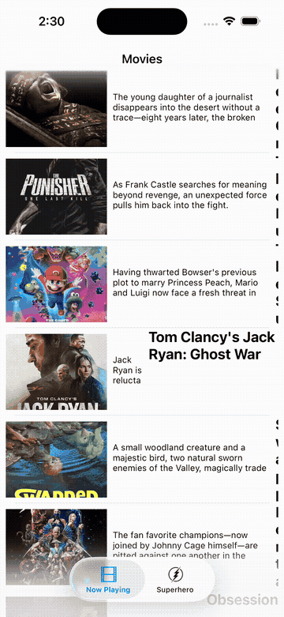

# Twitter iOS

> Full iOS Twitter client that drives the Twitter API v1.1 through a `BDBOAuth1SessionManager` subclass, handling the complete three-legged OAuth 1.0a flow with session persistence, an infinite-scroll timeline, live retweet/like toggling, and user profile pages.

## Features

- **OAuth 1.0a three-legged flow:** `TwitterClient.login` fetches a request token via `fetchRequestToken(withPath:method:callbackURL:...)`, opens `api.twitter.com/oauth/authorize` in Safari, then `handleOpenUrl` exchanges the callback `oauth_token` for an access token via `fetchAccessToken(withPath:method:requestToken:...)`
- **Session persistence:** The authenticated user is serialized to `NSData` with `JSONSerialization.data` and stored in `UserDefaults` under `"currentUserData"`, restoring `User.currentUser` on next launch without re-authenticating
- **Home timeline:** `TwitterClient.homeTimeline` issues a GET to `1.1/statuses/home_timeline.json` through `BDBOAuth1SessionManager`, deserializes the response array into `[Tweet]` via `Tweet.tweetsWithArray`, and delivers results on the main queue
- **Infinite scroll:** `TweetsViewController` implements `UIScrollViewDelegate.scrollViewDidScroll` — when `contentOffset.y` exceeds `contentSize.height - bounds.height` while dragging, it sets `isMoreDataLoading = true`, animates a custom `InfiniteScrollActivityView` spinner added to the table's content inset, and fetches the next batch
- **Pull-to-refresh:** A `UIRefreshControl` inserted at subview index 0; its `valueChanged` action calls `TwitterClient.homeTimeline` and ends refreshing in the success handler
- **Retweet and like toggling:** `TweetDetailViewController` calls `TwitterClient.retweet`/`unretweet` (POST to `1.1/statuses/retweet/{id}.json` / `unretweet/{id}.json`) and `like`/`unlike` (POST to `1.1/favorites/create.json` / `destroy.json`), updating button images between normal and green/red variants on success
- **Relative timestamps:** `TwitterCell` computes `timeDiff = Date().timeIntervalSince(tweet.timestamp)` and formats it as `"Xm"`, `"Xh"`, or `"X days ago"` without any third-party date library
- **User profile view:** `ProfileViewController` loads cover photo and profile image via `UIImageView.loadImage(from: _:)` and displays tweet count, follower count, and following count parsed from `account/verify_credentials.json`
- **Compose screen:** `ComposeViewController` enforces the 140-character limit in `UITextViewDelegate.textView(_:shouldChangeTextIn:replacementText:)`, updating a countdown `UILabel` on every keystroke

## Tech Stack

| Layer | Technology |
|---|---|
| Language | Swift 6.0 |
| UI | UIKit, Auto Layout, UITableViewAutomaticDimension |
| Networking | URLSession (native)|
| API | Twitter API v1.1 |
| Auth | OAuth 1.0a (BDBOAuth1SessionManager) |
| Persistence | UserDefaults (user session), NotificationCenter (logout broadcast) |
| Dependencies | CocoaPods |

## Architecture

`TwitterClient` is a singleton `BDBOAuth1SessionManager` subclass that owns all API calls. `LoginViewController` triggers the OAuth flow; on success it segues to `TweetsViewController` which drives the main `UITableView`. Tapping a cell passes the `Tweet` model through `prepare(for:sender:)` to `TweetDetailViewController`. Tapping a profile avatar button walks the view hierarchy (`button.superview?.superview`) to resolve the cell's index path and passes the `User` model to `ProfileViewController`. Logout posts a `UserDidLogout` notification that `AppDelegate` observes to swap the root view controller back to `LoginViewController`.

## Key Implementation

**BDBOAuth1SessionManager over AFHTTPSessionManager:** `TwitterClient` subclasses `BDBOAuth1SessionManager` rather than plain `AFHTTPSessionManager` so OAuth 1.0a signature generation (nonce, timestamp, HMAC-SHA1) is handled by Mock data (API deprecated)